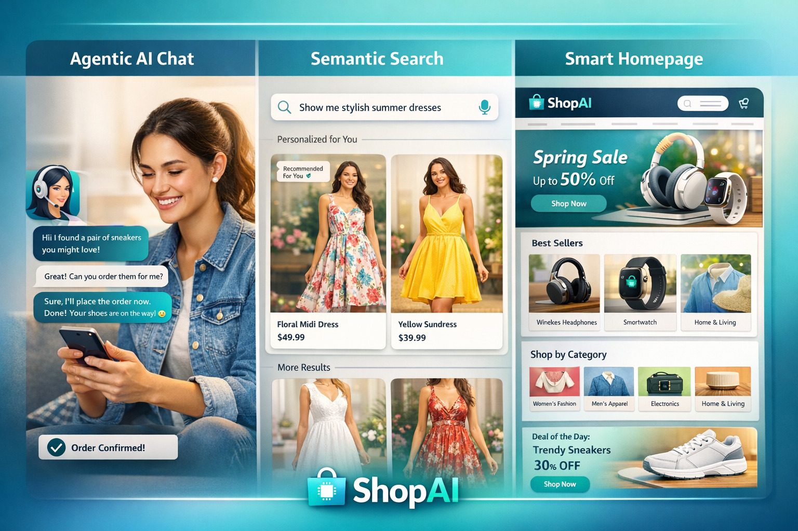
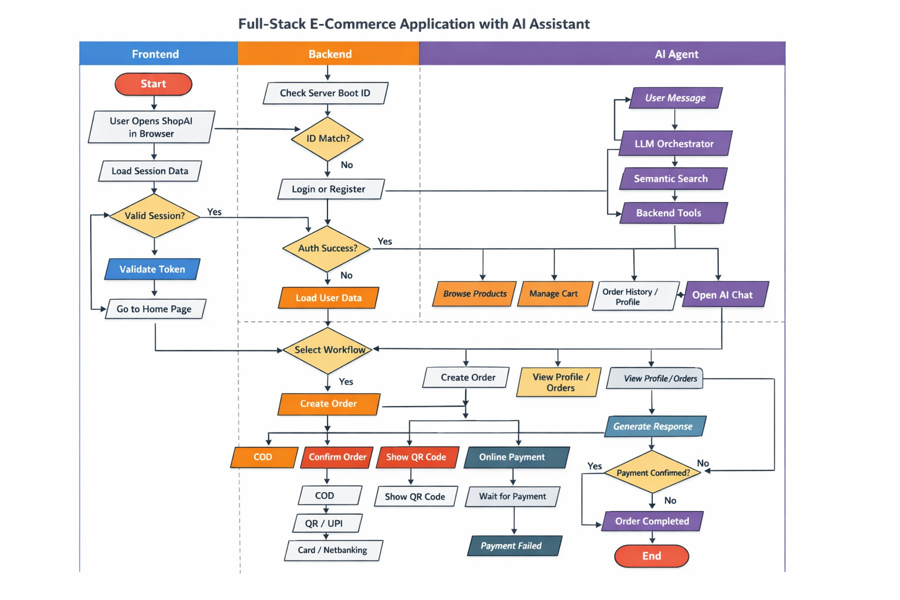
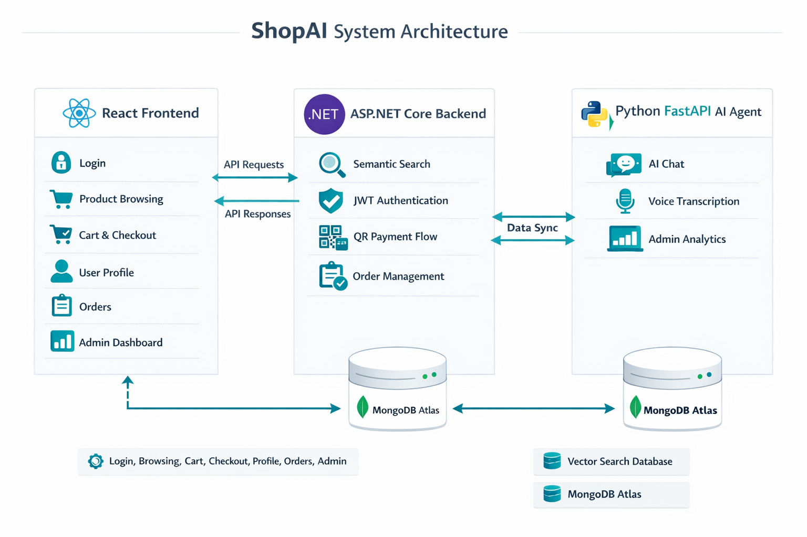

# ShopAI — Full-Stack E-Commerce Platform with AI Shopping Assistant

A production-ready, three-tier e-commerce application combining a **.NET 8 REST API**, a **React 18 frontend**, and a **Python AI agent** with semantic product search and conversational shopping capabilities.

---

## Table of Contents

- [Architecture Overview](#architecture-overview)
- [Project Visuals](#project-visuals)
- [Features](#features)
- [Tech Stack](#tech-stack)
- [Project Structure](#project-structure)
- [Getting Started](#getting-started)
  - [Prerequisites](#prerequisites)
  - [Backend Setup](#backend-setup)
  - [Frontend Setup](#frontend-setup)
  - [AI Agent Setup](#ai-agent-setup)
- [Environment Variables](#environment-variables)
- [API Reference](#api-reference)
- [AI Agent Details](#ai-agent-details)
- [Deployment](#deployment)

---

## Architecture Overview

```
┌──────────────────────┐        ┌──────────────────────────┐        ┌─────────────────────┐
│   React Frontend     │◄──────►│   .NET 8 REST API        │◄──────►│   Python AI Agent   │
│   (React 18 + TW)    │        │   (ASP.NET Core)         │        │   (FastAPI)         │
│   Port: 3000         │        │   Port: 5033             │        │   Port: 7860        │
└──────────────────────┘        └──────────┬───────────────┘        └──────────┬──────────┘
                                           │                                    │
                                           ▼                                    ▼
                                  ┌─────────────────┐               ┌─────────────────────┐
                                  │   MongoDB Atlas  │               │   MongoDB Atlas     │
                                  │   (Primary DB)   │               │   (Vector Search)   │
                                  └─────────────────┘               └─────────────────────┘
```

The **.NET backend** acts as the central hub: it serves all REST endpoints and also proxies requests to the Python AI agent. The **AI agent** uses semantic vector search (sentence-transformers) and pluggable LLMs (Groq, OpenAI, Anthropic, Ollama) for conversational responses.

---

## Project Visuals

### ShopAI


### Feature Poster (3 Core Experiences)



### End-to-End Flowchart



### System Architecture



---

## Features

### Customer Features
- **User Authentication** — Registration, login with JWT, phone OTP (Twilio), and email OTP
- **Product Catalog** — Browse, filter, and search products by category and keyword
- **AI Chat Assistant** — Conversational shopping powered by ShopAI (semantic search + LLM)
- **Semantic Product Search** — Vector-similarity search via `all-MiniLM-L6-v2` embeddings
- **Shopping Cart** — Add, update, remove items; persistent across sessions
- **Checkout & Orders** — Place orders, view order history, cancel orders
- **QR Payments** — QR code-based payment flow
- **Address Management** — Save and manage multiple shipping addresses
- **Profile Management** — View and update personal details

### Admin Features
- **Admin Dashboard** — Overview of sales, orders, and customers
- **Product Management** — Create, update, and delete products
- **Order Management** — View and update all orders
- **Customer Management** — View registered customers
- **Sales Reports** — Sales analytics and reporting
- **Stock Analysis** — Monitor inventory levels
- **QR Payment Management** — Handle QR-based transactions

---

## Tech Stack

### Backend (`/backend`)
| Technology | Purpose |
|---|---|
| .NET 8 / ASP.NET Core | REST API framework |
| MongoDB + MongoDB.Driver | Primary database |
| JWT Bearer Authentication | Stateless auth |
| Twilio | SMS OTP delivery |
| SMTP (Gmail) | Email OTP & order notifications |
| Swagger / OpenAPI | API documentation |
| Docker | Containerisation |

### Frontend (`/frontend`)
| Technology | Purpose |
|---|---|
| React 18 | UI framework |
| Tailwind CSS | Utility-first styling |
| React Router v7 | Client-side routing |
| Axios | HTTP client |
| Framer Motion | Animations |
| Lucide React | Icon library |

### AI Agent (`/ai_agent`)
| Technology | Purpose |
|---|---|
| Python 3.11 + FastAPI | Agent microservice |
| sentence-transformers (`all-MiniLM-L6-v2`) | Semantic embeddings |
| Groq (default) | LLM inference (llama-3.1-8b-instant) |
| OpenAI / Anthropic / Ollama | Alternative LLM providers |
| MongoDB | Embedding storage |
| Docker | Containerisation / HF Spaces deployment |

---

## Project Structure

```
ECommerceAPI/
├── backend/                          # .NET 8 ASP.NET Core API
│   ├── Dockerfile
│   ├── ECommerceAPI.sln
│   └── src/
│       ├── ECommerceAPI.API/         # Controllers, Middleware, Program.cs
│       │   ├── Controllers/          # Auth, Products, Cart, Orders, AI, QRPayment, Search, ...
│       │   ├── Middleware/           # JWT + Error handler middleware
│       │   └── Attributes/           # Custom authorize attributes
│       ├── ECommerceAPI.Application/ # Business logic layer
│       │   ├── DTOs/                 # Request/response models
│       │   ├── Interfaces/           # Service contracts
│       │   └── Services/             # Service implementations
│       ├── ECommerceAPI.Domain/      # Domain entities and enums
│       └── ECommerceAPI.Infrastructure/ # Repositories, DB config
│
├── frontend/                         # React 18 SPA
│   ├── public/
│   └── src/
│       ├── pages/                    # HomePage, ProductsPage, CartPage, CheckoutPage, ...
│       ├── components/               # Header, ChatWidget, FloatingChatButton, QRModal
│       ├── hooks/                    # useAuth, useCart, useProducts, useAdmin
│       ├── utils/                    # constants.js, helpers.js
│       └── api.js                    # Axios instance + all API calls
│
└── ai_agent/                         # Python FastAPI AI microservice
    ├── main.py                       # FastAPI app + routes
    ├── orchestrator.py               # Intent → action → response pipeline
    ├── llm_agent.py                  # Intent extraction + LLM response generation
    ├── api_client.py                 # HTTP client for /api/ai/* on .NET backend
    ├── semantic_search.py            # Vector search against MongoDB
    ├── generate_embeddings.py        # One-time embedding generation script
    ├── models.py                     # Pydantic request/response models
    ├── requirements.txt
    └── Dockerfile
```

---

## Getting Started

### Prerequisites

- [.NET 8 SDK](https://dotnet.microsoft.com/download/dotnet/8)
- [Node.js 18+](https://nodejs.org/)
- [Python 3.11+](https://www.python.org/)
- [MongoDB Atlas](https://www.mongodb.com/cloud/atlas) account (or local MongoDB)
- A Groq API key (free at [console.groq.com](https://console.groq.com)) — or use Ollama locally

---

### Backend Setup

```bash
cd backend

# Restore NuGet packages
dotnet restore ECommerceAPI.sln

# Set environment variables (or edit appsettings.Development.json)
# See the Environment Variables section below

# Run the API
dotnet run --project src/ECommerceAPI.API/ECommerceAPI.API.csproj
```

The API will be available at `http://localhost:5033`.  
Swagger UI: `http://localhost:5033/swagger`

---

### Frontend Setup

```bash
cd frontend

# Install dependencies
npm install

# Copy and fill in environment variables
cp .env.example .env   # Edit REACT_APP_API_URL and REACT_APP_AI_AGENT_URL

# Start the dev server
npm start
```

The frontend will be available at `http://localhost:3000`.

---

### AI Agent Setup

```bash
cd ai_agent

# Create a virtual environment
python -m venv .venv
source .venv/bin/activate   # Windows: .venv\Scripts\activate

# Install dependencies
pip install -r requirements.txt

# Copy and fill in environment variables
cp .env.example .env   # Edit MONGO_URI, DB_NAME, LLM_PROVIDER, GROQ_API_KEY, ...

# (First time only) Generate product embeddings and store them in MongoDB
python generate_embeddings.py

# Start the agent
uvicorn main:app --reload --port 7860
```

The AI agent will be available at `http://localhost:7860`.  
Docs: `http://localhost:7860/docs`

---

## Environment Variables

### Backend — `appsettings.json` / environment

| Key | Description |
|---|---|
| `MongoDbSettings:ConnectionString` | MongoDB Atlas connection string |
| `MongoDbSettings:DatabaseName` | Database name (e.g. `ECommerceDB`) |
| `Jwt:SecretKey` | Secret used to sign JWT tokens |
| `Jwt:Issuer` | JWT issuer (e.g. `ECommerceAPI`) |
| `Jwt:Audience` | JWT audience (e.g. `ECommerceClient`) |
| `Jwt:ExpiryInMinutes` | Token lifetime in minutes |
| `AIAgent:ServiceUrl` | URL of the Python AI agent |
| `AIAgent:ApiKey` | Shared secret for agent-to-backend calls |
| `OtpSettings:TwilioAccountSid` | Twilio SID for SMS OTP |
| `OtpSettings:TwilioAuthToken` | Twilio auth token |
| `OtpSettings:TwilioPhoneNumber` | Twilio sending number |
| `EmailSettings:SmtpHost` | SMTP host (e.g. `smtp.gmail.com`) |
| `EmailSettings:SmtpUsername` | Email sender address |
| `EmailSettings:SmtpPassword` | Email app password |

### Frontend — `.env`

| Key | Description |
|---|---|
| `REACT_APP_API_URL` | Base URL of the .NET backend |
| `REACT_APP_AI_AGENT_URL` | Base URL of the Python AI agent |

### AI Agent — `.env`

| Key | Description |
|---|---|
| `MONGO_URI` | MongoDB Atlas connection string |
| `DB_NAME` | Database name |
| `API_BASE_URL` | .NET backend base URL (e.g. `http://localhost:5033/api`) |
| `LLM_PROVIDER` | `groq` \| `openai` \| `anthropic` \| `ollama` \| `none` |
| `LLM_MODEL` | Model name (e.g. `llama-3.1-8b-instant`) |
| `GROQ_API_KEY` | Groq API key |
| `OPENAI_API_KEY` | OpenAI API key (if using OpenAI) |
| `ANTHROPIC_API_KEY` | Anthropic API key (if using Anthropic) |
| `LLM_BASE_URL` | Ollama base URL (default: `http://localhost:11434`) |

---

## API Reference

All backend routes are prefixed with `/api`.

### Authentication — `/api/auth`
| Method | Route | Description |
|---|---|---|
| POST | `/register` | Register a new user |
| POST | `/login` | Login and receive JWT |
| POST | `/send-otp` | Send phone OTP (Twilio) |
| POST | `/verify-otp` | Verify phone OTP |

### Products — `/api/products`
| Method | Route | Description |
|---|---|---|
| GET | `/` | List all products |
| GET | `/{id}` | Get product by ID |
| POST | `/` | Create product (admin) |
| PUT | `/{id}` | Update product (admin) |
| DELETE | `/{id}` | Delete product (admin) |

### Cart — `/api/cart`
| Method | Route | Description |
|---|---|---|
| GET | `/` | Get current user's cart |
| POST | `/add` | Add item to cart |
| PUT | `/update/{productId}` | Update item quantity |
| DELETE | `/remove/{productId}` | Remove item |
| DELETE | `/clear` | Clear entire cart |

### Orders — `/api/orders`
| Method | Route | Description |
|---|---|---|
| GET | `/` | Get order history |
| GET | `/{id}` | Get order by ID |
| POST | `/place` | Place an order |
| POST | `/{id}/cancel` | Cancel an order |

### AI Chat — `/api/ai`
| Method | Route | Description |
|---|---|---|
| GET | `/context` | Full user context (products + cart + orders + addresses) |
| GET | `/products/search` | Semantic product search |
| POST | `/products/compare` | Side-by-side product comparison |
| GET | `/cart` | Get cart (agent-facing) |
| POST | `/orders/place` | Place order via agent |

### Search — `/api/search`
| Method | Route | Description |
|---|---|---|
| GET | `/?q=` | Full-text product search |

---

## AI Agent Details

The AI agent (`ShopAI`) is a FastAPI microservice that provides:

### Endpoints
| Method | Route | Description |
|---|---|---|
| GET | `/` | Health check |
| POST | `/chat` | Send a chat message, receive a response |
| POST | `/search` | Semantic vector search |

### Chat Pipeline
```
User message
     │
     ▼
LLMAgent.extract_intent()      ← rule-based OR real LLM (Groq/OpenAI/Anthropic)
     │
     ▼
ShoppingAgentOrchestrator      ← maps intent → /api/ai/* call on .NET backend
     │
     ▼
LLMAgent.generate_response()   ← formats API result into natural language
     │
     ▼
ChatResponse { text, products }
```

### Supported Intents
| Intent | Action |
|---|---|
| `search_product` | Vector search + ranked results |
| `compare_products` | Side-by-side comparison |
| `add_to_cart` | Add product to cart |
| `view_cart` / `update_cart` / `remove_from_cart` | Cart management |
| `place_order` | Checkout from cart |
| `order_history` / `cancel_order` | Order operations |
| `get_context` | Fetch full user state |
| `greeting` / `other` | Conversational replies |

### Switching LLM Providers
Set `LLM_PROVIDER` in `.env`:
```
# Groq (recommended — fast, free tier)
LLM_PROVIDER=groq
LLM_MODEL=llama-3.1-8b-instant
GROQ_API_KEY=gsk_...

# OpenAI
LLM_PROVIDER=openai
LLM_MODEL=gpt-4o-mini
OPENAI_API_KEY=sk-...

# Anthropic
LLM_PROVIDER=anthropic
LLM_MODEL=claude-haiku-4-5-20251001
ANTHROPIC_API_KEY=sk-ant-...

# Ollama (local, no API key needed)
LLM_PROVIDER=ollama
LLM_MODEL=mistral
LLM_BASE_URL=http://localhost:11434
```

---

## Deployment

### Backend — Render
The backend Dockerfile is a **multi-stage build** (SDK → runtime). Deploy to [Render](https://render.com) by:
1. Connecting your GitHub repository.
2. Selecting **Docker** as the environment.
3. Setting all required environment variables in Render's dashboard.

### AI Agent — Hugging Face Spaces
The agent is designed to run on [HF Spaces](https://huggingface.co/spaces):
- Exposes port `7860` (required by HF Spaces).
- The `all-MiniLM-L6-v2` model is baked into the Docker image at build time for instant cold starts.
- Secrets are injected as environment variables from HF Space Settings → Repository Secrets.

### Frontend — Static Hosting
Build and deploy to any static host (Vercel, Netlify, GitHub Pages):
```bash
cd frontend
npm run build   # outputs to /build
```
